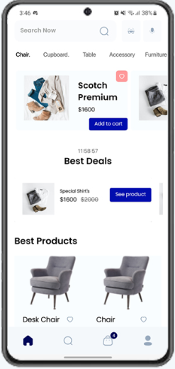
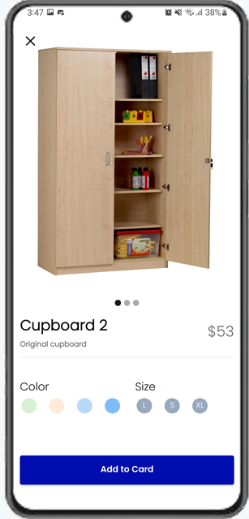
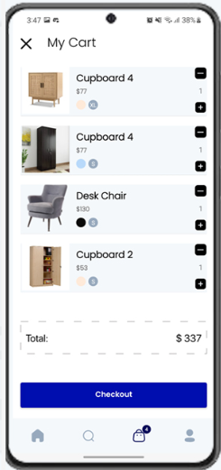
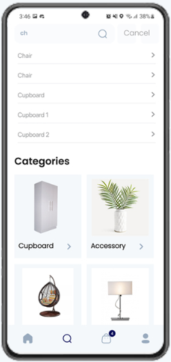

# E-Commerce App  

A modern e-commerce mobile application built with **Kotlin**, designed to provide users with a seamless shopping experience.  

---

## 🚀 Features  
- **User Authentication:** Login, signup, and password reset.  
- **Product Listing:** Browse products by category and apply filters.  
- **Product Details:** View product descriptions, ratings, and reviews.  
- **Search Functionality:** Search products by name or category.  
- **Cart Management:** Add, update, and remove items.  
- **Order Placement:** Secure checkout with payment gateway integration.  
- **User Profile:** View and update user details and order history.  

---

## 🛠️ Tech Stack  
- **Programming Language:** Kotlin  
- **Architecture:** MVVM (Model-View-ViewModel)  
- **Backend:** Firebase  
- **Database:** Firebase Firestore  

---

## 🔧 Setup and Installation  

### Prerequisites  
- Android Studio installed  
- Firebase project configured ([Firebase Setup](https://firebase.google.com/))  

### Steps  
1. Clone the repository:  
   ```bash
   git clone https://github.com/Elvin5002/E-Commerce.git
   ```  

2. Open the project in Android Studio.  

3. Sync Gradle files to download dependencies.  

4. Add your Firebase configuration file:  
   - `google-services.json` for Android.  

5. Run the application on an emulator or a physical device:  
   ```bash
   ./gradlew assembleDebug
   ```  

---

## 🖼️ Screenshots  
| Home Screen | Product Details | Cart | Search |
|:-----------:|:---------------:|:----:|
|  |  |  |   |   

---

## 🤝 Contributing  
Contributions are welcome!  

1. Fork the repository.  
2. Create a feature branch:  
   ```bash
   git checkout -b feature-name
   ```  
3. Commit your changes:  
   ```bash
   git commit -m "Add feature name"
   ```  
4. Push to the branch:  
   ```bash
   git push origin feature-name
   ```  
5. Open a pull request.  

---

## 📧 Contact  
For inquiries or feedback, contact:  

**[Your Name]**  
- Email: [eseyfullayev51@gmail.com](mailto:eseyfullayev51@gmail.com)  
- GitHub: [https://github.com/Elvin5002](https://github.com/Elvin5002)  

---  
